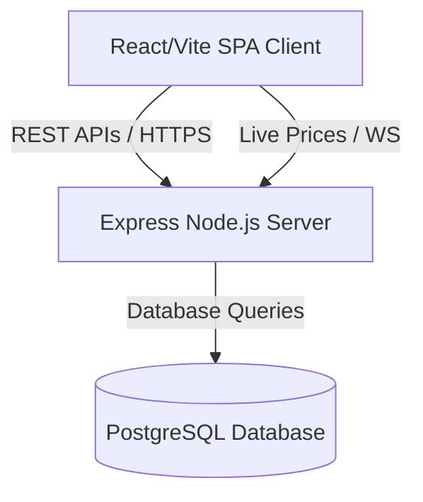

# About Veridion Financial Sandbox

Veridion is a compliant single-page React framework financial sandbox. It acts as an interactive simulation gateway for testing, trading, and securing digital assets, including Bitcoin (BTC), Ethereum (ETH), and Veridion's own state currency, Veridion Coin (VRDN).

---

## 1. System Architecture

* **Frontend**: Single-page application compiled using Vite, TypeScript, and styled with custom CSS layout tokens. State management is routed through the React Context API (`AppContext`).
* **Backend**: Express.js server written in TypeScript. Session tokens are signed using JSON Web Tokens (JWT) with separate Access and Refresh token paths.
* **Database Layer**: PostgreSQL instances mapped and migrated using Prisma ORM.

---

## 2. Core Features

### 🛡️ Core Security Infrastructure
Veridion emulates institutional banking security requirements:
* **MFA Dual-Factor TOTP**: Standard RFC 6238 time-based verification tokens. Active configurations present users with authenticator QR codes and verification challenges.
* **Console Inactivity Lock**: Live counter monitoring user inputs. If inactivity exceeds a configured threshold, the console overlay freezes, requiring the password to restore the session.
* **Geographical Device Audit**: Every login registers the browser agent and estimates geolocation coordinates. Users can inspect all active sessions and manually revoke devices.
* **Security Logs Audit Trail**: Every sensitive state change (MFA adjustments, credentials verification, password rotations) generates permanent audit logs.

### 📈 Simulated Exchange Desk
* **Dynamic Index Feeds**: A background price simulator runs a mathematical random-walk model to emulate dynamic fluctuations for BTC, ETH, and VRDN.
* **Ledger Settlement Handshakes**: Mock transactions resolve against the database with validation signatures. Users can load mock cash ($10,000 increments) to test balances.

### 🏛️ Sovereign Staking & Block Explorer Portal
An exclusive portal centered on the government-backed `VRDN` blockchain:
* **Sovereign Yield Generator**: Staking locks that deduct liquid `VRDN` balances and deposit them into government treasury vaults.
* **Compounding Yield Ticker**: Yield compounding programmatically on every 1-second interval at a guaranteed **8.50% APY**, which users can claim to their liquid balance.
* **Consensus Explorer**: A simulated node explorer visualizing block consensus speed (sub-millisecond verification times), transactions, validator identifiers, and statuses on Veridion's ledger.
