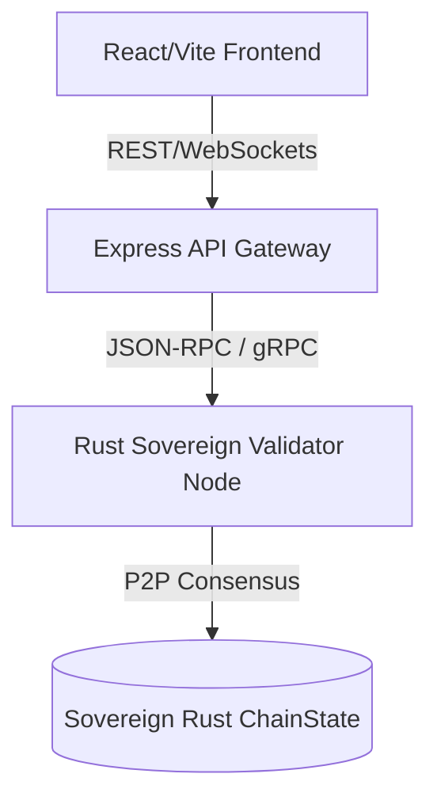
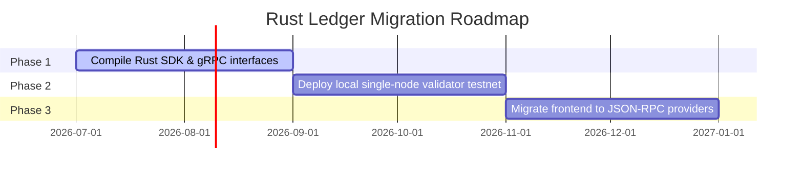

# Blockchain Rust Integration & Migration Path

As Veridion scales, the sandbox ledger will transition from local database simulation structures to a **Rust-based sovereign blockchain ledger** (using Substrate, custom consensus engines, or a Wasm-based execution runtime). 

This document details the planned integration architectures, interface schemas, and RPC specifications for bridging this single-page gateway to the Rust consensus nodes.

---

## 1. Rust Integration Architecture



* **Express API Gateway**: Acts as the Web2-to-Web3 translation layer, managing user accounts, geolocations, devices, and session security, while routing ledger operations to Rust nodes.
* **Rust Validator Nodes**: Execute consensus, validate transaction hashes, and package blocks into the chain state.
* **gRPC / JSON-RPC**: High-speed communication channels between the Node.js API server and the Rust network.

---

## 2. API & RPC Payload Schemas (Rust Compatible)

To facilitate interoperability, all payload parameters follow strict Rust-compatible struct definitions.

### A. Swap Transaction Handshake
**RPC Endpoint**: `/api/v1/ledger/trade`  
**Method**: `POST`  
**Rust Equivalent Struct**:
```rust
#[derive(Serialize, Deserialize, Debug)]
pub struct TradePayload {
    pub user_uuid: String,
    pub asset: String,      // "BTC", "ETH", or "VRDN"
    pub action: String,     // "BUY" or "SELL"
    pub volume: f64,
    pub timestamp: u64,
}
```

### B. Sovereign Staking Lock
**RPC Endpoint**: `/api/v1/ledger/stake`  
**Method**: `POST`  
**Rust Equivalent Struct**:
```rust
#[derive(Serialize, Deserialize, Debug)]
pub struct StakingPayload {
    pub user_uuid: String,
    pub lock_amount: f64,
    pub staking_action: String, // "LOCK" or "RELEASE"
    pub timestamp: u64,
}
```

---

## 3. WebSocket Block Minting Events

When a Rust validator node mints a block, it broadcasts the event over WebSockets to the Node.js backend to push real-time telemetry to the dashboard console.

### Event Format:
```json
{
  "event": "block_minted",
  "data": {
    "block_number": 782415,
    "validator_node": "Gov-Node-01-Primary",
    "transactions_count": 8,
    "settlement_duration_seconds": 0.0012,
    "block_size_kb": 1.74,
    "state_root": "0x51c72f...91aa",
    "timestamp": 1784027220
  }
}
```

---

## 4. Migration Timeline


