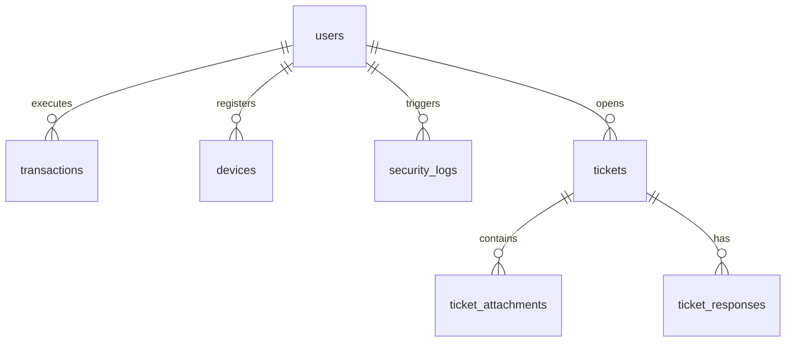

# Veridion Database Schema & Data Models

Veridion uses PostgreSQL as its primary data store, managed through Prisma ORM. Below is the documentation of all database models, fields, and relationships.

---

## 1. Data Models Diagram

---

## 2. Models Detail

### `User` (`users` table)
Represents an authenticated sandbox account containing identity, security configurations, and asset balances.

| Field Name | Type | Attributes | Description |
| :--- | :--- | :--- | :--- |
| `id` | `String` | `@id`, `default(cuid())` | Primary key. |
| `uuid` | `String` | `@unique` | Cryptographically generated external identifier (e.g. `UID-87F9A01B`). |
| `email` | `String` | `@unique` | Client email coordinate. Normalized to lowercase. |
| `name` | `String` | - | Client full name. |
| `passwordHash` | `String` | - | bcrypt hashed password (12 rounds). |
| `createdAt` | `DateTime` | `default(now())` | Account registration timestamp. |
| `is2faEnabled` | `Boolean` | `default(false)` | Flag indicating if MFA Dual-Factor TOTP is active. |
| `twoFactorSecret` | `String?` | - | Encrypted or plain Base32 TOTP secret key for authenticator apps. |
| `lockTimeoutSeconds` | `Int` | `default(60)` | Configured console inactivity lock timeout. |
| `resetTokenHash` | `String?` | - | SHA-250 hash of the active password reset token. |
| `resetTokenExpiresAt`| `DateTime?` | - | Expiration timestamp of the reset token. |
| `balanceUSD` | `Decimal` | `default(15400.00)` | Liquid mock USD cash pool balance (18, 2 precision). |
| `balanceBTC` | `Decimal` | `default(0.1245)` | Custodial Bitcoin balance (18, 8 precision). |
| `balanceETH` | `Decimal` | `default(1.8450)` | Custodial Ethereum balance (18, 8 precision). |
| `balanceVRDN` | `Decimal` | `default(2500.00)` | Custodial Veridion Coin (VRDN) balance (18, 8 precision). |

---

### `Transaction` (`transactions` table)
Logs all currency swaps, cash pool replenishments, and token settlements executed in the sandbox.

| Field Name | Type | Attributes | Description |
| :--- | :--- | :--- | :--- |
| `id` | `String` | `@id`, `default(cuid())` | Primary key. |
| `displayId` | `String` | `@unique` | External transaction code (e.g. `TX-9021A`). |
| `userId` | `String` | - | Foreign key referencing `User.id` (cascades on delete). |
| `date` | `DateTime` | `default(now())` | Date of execution. |
| `action` | `String` | - | Description of the action (e.g. `BUY Bitcoin (BTC)`, `DEPOSIT CASH POOL`). |
| `asset` | `String?` | - | Ticker of target asset (`BTC`, `ETH`, `VRDN`). |
| `flow` | `String` | - | Net coordinates flow (e.g., `+0.0245 BTC / -$1,647.39 USD`). |
| `hash` | `String` | - | Simulated cryptographic ledger hash signature. |
| `verification` | `String` | - | Validation check code (e.g. `SYSTEM-INIT` or `VRD-OK-98`). |

---

### `Device` (`devices` table)
Tracks clients' active devices, login locales, and refresh token hashes for session management.

| Field Name | Type | Attributes | Description |
| :--- | :--- | :--- | :--- |
| `id` | `String` | `@id`, `default(cuid())` | Primary key. |
| `displayId` | `String` | - | External device identifier (e.g. `DEV-01`). |
| `userId` | `String` | - | Foreign key referencing `User.id` (cascades on delete). |
| `name` | `String` | - | Device OS / browser user agent info. |
| `location` | `String` | - | IP-based geographical location estimate. |
| `ip` | `String` | - | Client IPv4 or IPv6 address. |
| `status` | `String` | `default("Secondary")` | Primary or Secondary device categorization. |
| `refreshTokenHash` | `String` | `@unique` | SHA-256 hash of the JWT refresh token JTI. |
| `lastActiveAt` | `DateTime` | `default(now())` | Timestamp of the last verified activity. |
| `revokedAt` | `DateTime?`| - | Revocation timestamp if session was logged out or terminated. |

---

### `SecurityLog` (`security_logs` table)
Audit log database detailing security events (verifications, settings adjustments, login failures).

| Field Name | Type | Attributes | Description |
| :--- | :--- | :--- | :--- |
| `id` | `String` | `@id`, `default(cuid())` | Primary key. |
| `userId` | `String` | - | Foreign key referencing `User.id` (cascades on delete). |
| `date` | `DateTime` | `default(now())` | Event occurrence timestamp. |
| `action` | `String` | - | Event description (e.g. `Credentials Verified`, `Password Reset Completed`). |
| `status` | `String` | - | Outcome status (`SUCCESS`, `FAILURE`). |

---

### `Ticket` (`tickets` table)
Support desks logs detailing user-submitted incident reports and inquiries.

| Field Name | Type | Attributes | Description |
| :--- | :--- | :--- | :--- |
| `id` | `String` | `@id`, `default(cuid())` | Primary key. |
| `displayId` | `String` | `@unique` | External tracker ID (e.g. `VRD-TKT-1082`). |
| `userId` | `String?` | - | Foreign key referencing `User.id` (sets null on delete). |
| `name` | `String` | - | Submitter full name. |
| `email` | `String` | - | Submitter email address. |
| `category` | `String` | - | Classification (e.g. `Transaction issues`, `Account access problems`). |
| `subject` | `String` | - | Summary description. |
| `description` | `String` | - | Elaborated description of the incident. |
| `status` | `String` | `default("PENDING REVIEW")` | Ticket status (`PENDING REVIEW`, `UNDER INVESTIGATION`, `RESOLVED`). |
| `emailNotifications`| `Boolean`| `default(true)` | Flag indicating if email notifications are requested. |
| `date` | `DateTime` | `default(now())` | Submission timestamp. |

---

### `TicketAttachment` (`ticket_attachments` table)
Stores references to files uploaded as support incident attachments.

| Field Name | Type | Attributes | Description |
| :--- | :--- | :--- | :--- |
| `id` | `String` | `@id`, `default(cuid())` | Primary key. |
| `ticketId` | `String` | - | Foreign key referencing `Ticket.id` (cascades on delete). |
| `filename` | `String` | - | Original uploaded file name. |
| `path` | `String` | - | Relative path to local upload directory. |
| `mimeType` | `String` | - | File MIME type (e.g. `image/png`, `application/pdf`). |
| `size` | `Int` | - | File size in bytes. |

---

### `TicketResponse` (`ticket_responses` table)
Stores feedback and reply entries for tickets.

| Field Name | Type | Attributes | Description |
| :--- | :--- | :--- | :--- |
| `id` | `String` | `@id`, `default(cuid())` | Primary key. |
| `ticketId` | `String` | - | Foreign key referencing `Ticket.id` (cascades on delete). |
| `sender` | `String` | - | Name/role of the message sender. |
| `date` | `DateTime` | `default(now())` | Response timestamp. |
| `message` | `String` | - | Markdown message content. |
